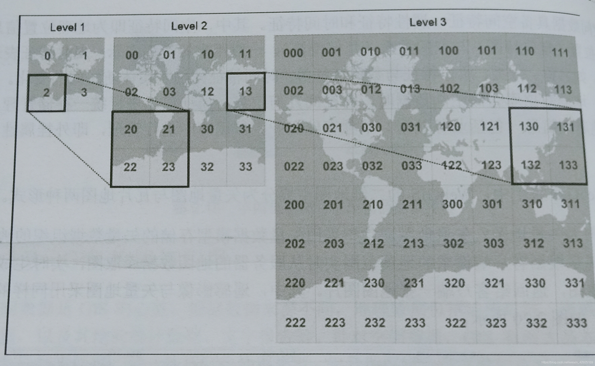

# OGC
OGC全称Open Geospatial Consortium，是一个非盈利的、国际化的、自愿协商的标准化组织，它的主要目的就是制定与空间信息、基于位置服务相关的标准。这些标准就是OGC的“产品”，而这些标准的用处就在于使不同厂商、不同产品之间可以通过统一的接口进行互操作。
# WMS
* Web地图服务，利用具有地理空间位置信息的数据制作地图，返回的是图层级的地图影像。数据形式矢量栅格都有。WMS支持HTTP协议，所支持的操作是由URL决定的。
* 这个规范定义了三个操作：
	* GetCapabilities返回服务级元数据，它是对服务信息内容和要求参数的一种描述； 
	* GetMap返回一个地图影像，其地理空间参考和大小参数是明确定义了的；
	* GetFeatureInfo（可选）返回显示在地图上的某些特殊要素的信息
	* GetLegendGraphic：返回地图的图例信息。
* **WMS-C**
	* WMS-C全称是Web Mapping Service - Cached，对它完整的定义来源于OSGeo Wiki，2006年在FOSS4G会议上提出讨论，目的在于提供一种预先缓存数据的方法，以提升地图请求的速度，自始至终该标准都没有写入OGC之中。
# WFS
* Web要素服务，返回的是矢量级的GML编码，并提供对矢量的增加、修改、删除等事务操作，是对Web地图服务的进一步深入。WFS通过OGC Filter构造查询条件，支持基于空间几何关系的查询，基于属性域的查询，当然还包括基于空间关系和属性域的共同查询。
* 这个服务定义了五个操作：
	* GetCapabilites返回Web矢量服务性能描述文档（用XML描述）；
	* DescribeFeatureType返回描述可以提供服务的任何矢量结构的XML文档；
	* GetFeature为一个获取矢量实例的请求提供服务；
	* Transaction与要素实例交互操作，该操作不仅能提供要素读取，同时支持要素在线编辑和事务处理；
	* LockFeature处理在一个事务期间对一个或多个矢量类型实例上锁的请求。
# WCS
* Web影像服务，面向空间影像数据，将这些数据在网上发布。
* WCS提供一下操作：
	* GetCapabitities：返回服务级元数据，它是对服务信息内容和要求参数的一种描述。
	* DescribeCoverage：支持用户从特定WCS服务器获取一个或多个覆盖的详细的描述文档
	* GetCoverage：可根据查询要求返回一个包含或者引用被请求的覆盖数据的响应文档
# WMTS
* 瓦片地图Web服务，WMTS标准定义了一些操作，这些操作允许用户访问瓦片地图。WMTS可能是OGC首个支持RESTful访问的服务标准。WMTS提供了一种采用预定义图块方法发布数字地图服务的标准化解决方案。WMTS弥补了WMS不能提供分块地图的不足。

* 与wms和wfs的区别
	WMTS相比WMS，牺牲掉灵活性来换取性能，返回的都是基础地图，所有静态数据的范围框和比例尺统统被限定在各个图块（瓦片）中。然后这些图块集使得对WMTS的实现只需要一个仅仅返回简单已有文件的web服务器即可。WFS与两者都不同，返回的是矢量数据，用于增删改操作。
# TMS(来自于OSGeo,不是标准的OGC)
* 切片地图服务(Tile Map Service), 定义了一些操作，这些操作允许用户按需访问切片地图，访问速度更快，还支持修改坐标系。与wmts的区别主要在于协议、瓦片组织方式。[TMS和WMTS大概对比](https://blog.csdn.net/yanqing0924/article/details/6066713)
# WPS
* Web处理服务，用于解决空间信息互操作的空间分析等问题。Processing即ArcView中的GeoProcessing，诸如Union，Intersect等方法。WPS要做的就是暴露基于URL接口来实现客户端通过WebService对此类方法的调用、并返回数据。
# CSW
* 目录服务，支持地理空间数据集的发布和搜索

# 总结
WMS：动态地图服务，在ArcGIS中我们经常利用理由的mxd文件发布的服务，就是这种地图服务，如果你的数据会变化，建议发这种服务。这种服务优点是动态，缺点是慢。
WMS-C：可以理解为WMS的升级版，预先缓存瓦片，按需请求，提高了访问的速度。
WMTS：相比WMS，牺牲了提供定制地图的灵活性，代之以通过提供静态数据（基础地图）来增强伸缩性，这些静态数据的范围框和比例尺被限定在各个图块内。
WFS：支持要素的增删改等事务操作，支持空间和属性查询。
WCS：主要是面向空间影像数据。
WPS：主要是用来发起web端的空间运算处理工作，比如裁切、合并等空间运算（相当于ArcGIS-Server的GP服务）。
TMS：即我们常说的‘切片地图服务’。

